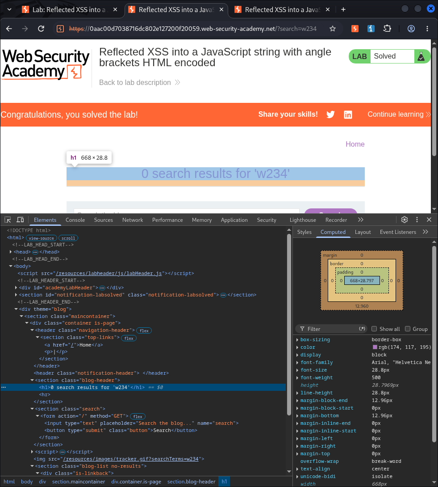

# cross-site-scripting-lab
# Reflected XSS into a JavaScript String with Angle Brackets HTML Encoded

## Lab Walkthrough

### 1. Intercept and Observe Input Reflection
Submit a random alphanumeric string (e.g., `w234`) in the search box. Use Burp Suite to intercept the search request and send it to **Burp Repeater**. 

Observe that the random string has been reflected directly inside a JavaScript string in the response:



---

### 2. Inject Payload to Break Out of JavaScript String
Replace your input with the following payload to break out of the JavaScript string and inject an `alert()` call:

```javascript
'-alert(1)-'
